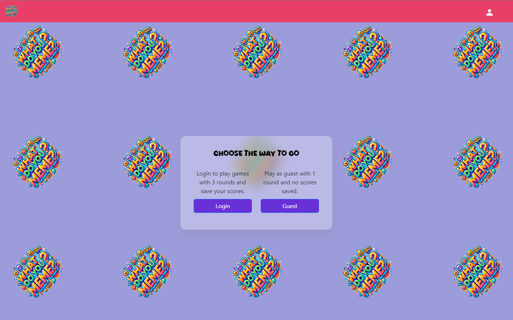
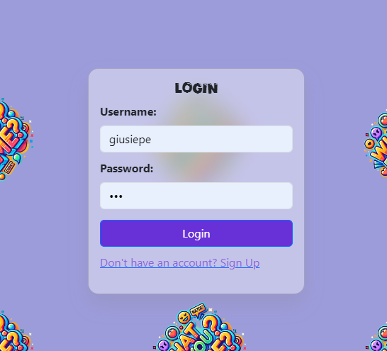
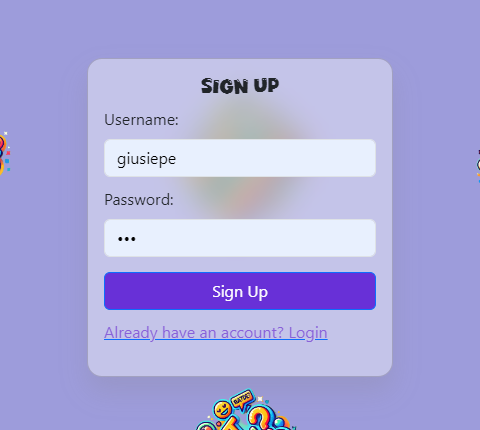
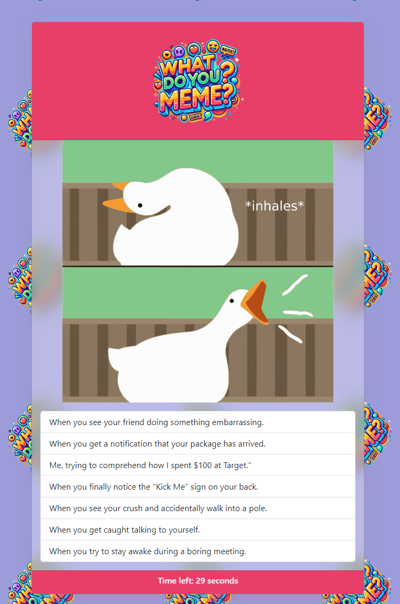
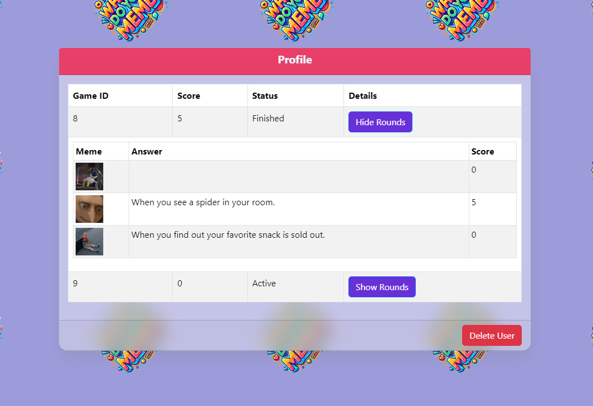
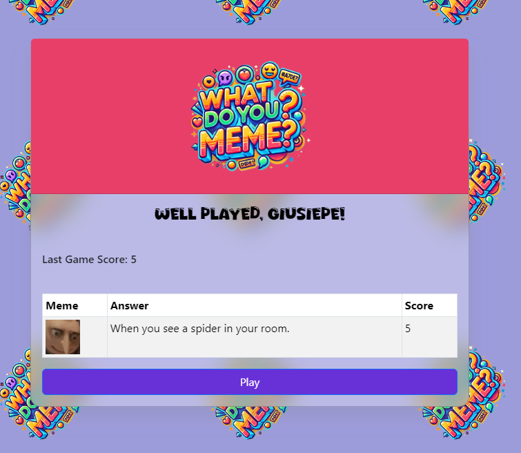
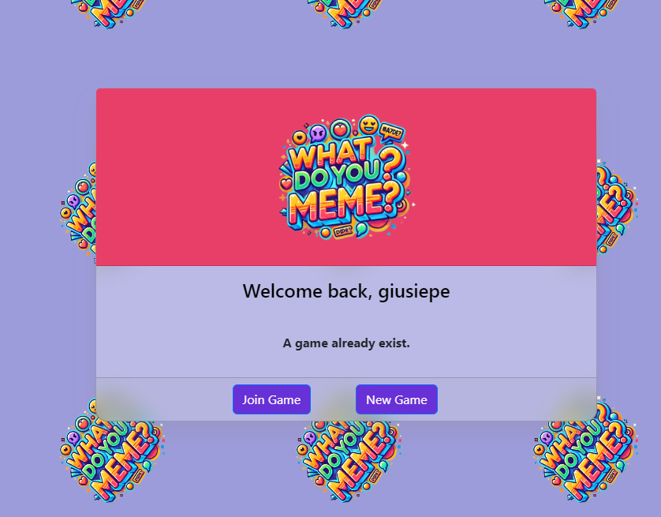
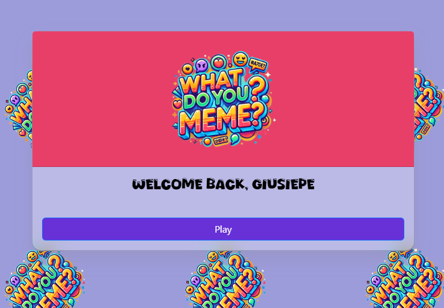

# "What Do You Meme?"

## React Client Application Routes

- Route `/`: 
  - **Page content and purpose**: Home page of the application. It gives an overview of the application and provides navigation to other parts of the application.
- Route `/login`: 
  - **Page content and purpose**: Login page where users can enter their credentials to access their account.
- Route `/signup`: 
  - **Page content and purpose**: Signup page for new users to create an account.
- Route `/game`: 
  - **Page content and purpose**: Main game interface where users can play the meme game.
- Route `/profile`: 
  - **Page content and purpose**: User profile page displaying user username and their game history.

## API Server

### User Routes

- **POST `/what-do-you-meme/users`**
  - **Description**: Creates a new user.
  - **Request Parameters**:
    - `username` (string, required): The username of the user.
    - `password` (string, required): The user's password.
  - **Response**: 200 OK if the user is successfully created.

- **DELETE `/what-do-you-meme/users`**
  - **Description**: Deletes the authenticated user.
  - **Response**: 200 OK if the user is successfully deleted.

### Authentication Session Routes

- **POST `/what-do-you-meme/sessions`**
  - **Description**: Logs in a user.
  - **Request Parameters**:
    - `username` (string, required): The username.
    - `password` (string, required): The password.
  - **Response**: 200 OK and the authenticated user in JSON format if the login is successful.

- **DELETE `/what-do-you-meme/sessions/current`**
  - **Description**: Logs out the authenticated user.
  - **Response**: 200 OK if the logout is successful.

- **GET `/what-do-you-meme/sessions/current`**
  - **Description**: Retrieves the authenticated user's information.
  - **Response**: 200 OK and the user's information in JSON format.

### Game Routes

- **POST `/what-do-you-meme/games/new`**
  - **Description**: Creates a new game for the authenticated user.
  - **Response**: 200 OK and the created game in JSON format.

- **POST `/what-do-you-meme/games/new-guest`**
  - **Description**: Creates a new game for a guest user.
  - **Response**: 200 OK and the created game in JSON format.

- **GET `/what-do-you-meme/games/all`**
  - **Description**: Retrieves all games of the authenticated user.
  - **Response**: 200 OK and the games in JSON format.

- **GET `/what-do-you-meme/games/:gameId`**
  - **Description**: Retrieves a specific game of the authenticated user.
  - **Request Parameters**:
    - `gameId` (string, required): The ID of the game.
  - **Response**: 200 OK and the game in JSON format.

- **GET `/what-do-you-meme/games/:gameId/round`**
  - **Description**: Retrieves the current round of a specific game for the authenticated user.
  - **Request Parameters**:
    - `gameId` (string, required): The ID of the game.
  - **Response**: 200 OK and the round in JSON format.

- **POST `/what-do-you-meme/games/:gameId/round`**
  - **Description**: Registers the result of a specific round for a game of the authenticated user.
  - **Request Parameters**:
    - `gameId` (string, required): The ID of the game.
    - `captionId` (number, required): The ID of the caption.
  - **Response**: 200 OK and the result in JSON format.

- **POST `/what-do-you-meme/games/:gameId/end`**
  - **Description**: Ends a specific game for the authenticated user.
  - **Request Parameters**:
    - `gameId` (string, required): The ID of the game.
  - **Response**: 200 OK if the game is successfully ended.

- **GET `/what-do-you-meme/games`**
  - **Description**: Retrieves the active game of the authenticated user.
  - **Response**: 200 OK and the game in JSON format.

### Meme Routes

- **GET `/what-do-you-meme/memes/:memeId`**
  - **Description**: Retrieves a specific meme.
  - **Request Parameters**:
    - `memeId` (string, required): The ID of the meme.
  - **Response**: 200 OK and the meme in JSON format.

### Caption Routes

- **GET `/what-do-you-meme/captions/:captionId`**
  - **Description**: Retrieves a specific caption.
  - **Request Parameters**:
    - `captionId` (string, required): The ID of the caption.
  - **Response**: 200 OK and the caption in JSON format.

### Round Routes

- **GET `/what-do-you-meme/rounds/:roundId`**
  - **Description**: Retrieves a specific round.
  - **Request Parameters**:
    - `roundId` (string, required): The ID of the round.
  - **Response**: 200 OK and the round in JSON format.

## Main React Components

### `Game` (in `Game.jsx`)
- **Purpose**: Manages the main game logic and user interactions during the game session.
- **Main Functionality**:
  - Starts a new game or resumes an existing game.
  - Handles the selection of captions by the user.
  - Manages the game state including score, rounds, and timer.

### `GameTable` (in `GameTable.jsx`)
- **Purpose**: Displays a table of games.
- **Main Functionality**:
  - Fetches and displays a list of games the user has participated in.
  - Provides details such as game ID, score, and status.

### `Home` (in `Home.jsx`)
- **Purpose**: Displays the home page of the application.
- **Main Functionality**:
  - Provides an overview of the application.
  - Contains navigation links to other parts of the app.

### `Login` (in `Login.jsx`)
- **Purpose**: Handles user login functionality.
- **Main Functionality**:
  - Provides a form for users to enter their username and password.
  - Submits login requests to the server and manages user authentication state.

### `MemeCard` (in `MemeCard.jsx`)
- **Purpose**: Displays a meme with its associated captions during a game round.
- **Main Functionality**:
  - Shows the meme image and a list of captions.
  - Manages user interactions such as selecting a caption and handling the timer for each round.

### `NavHeader` (in `NavHeader.jsx`)
- **Purpose**: Displays the navigation header.
- **Main Functionality**:
  - Provides navigation links to different routes in the application.
  - Shows the current user’s status and provides options to log in or log out.

### `Profile` (in `Profile.jsx`)
- **Purpose**: Displays the user's profile information.
- **Main Functionality**:
  - Shows the user's past games and their details.
  - Provides an option to delete the user account.

### `RoundTable` (in `RoundTable.jsx`)
- **Purpose**: Displays details of the rounds within a game.
- **Main Functionality**:
  - Shows information about each round such as the meme used, the user's answer, and the score for the round.

### `Signup` (in `Signup.jsx`)
- **Purpose**: Handles user registration.
- **Main Functionality**:
  - Provides a form for users to create a new account by entering a username and password.
  - Submits registration requests to the server and manages the user registration state.

## Screenshot

### Home Page

### Login Page

### Signup Page

### Game Page

### Profile Page

### End Game

### Game Exists

### Welcome Page

## Users Credentials

- **Test User 1**: 
  - Username: `aleromeo`
  - Password: `asd`
- **Test User 2**: 
  - Username: `giusiepe`
  - Password: `asd`
